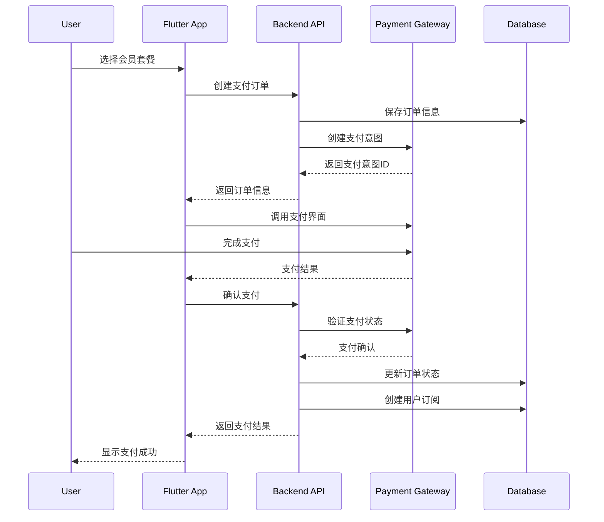
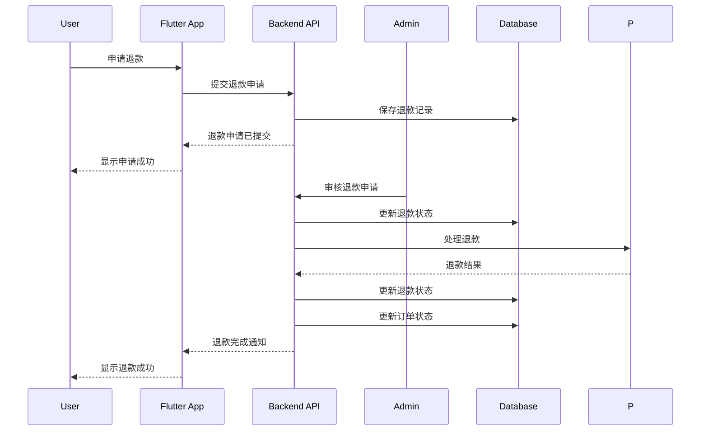

# 支付系统和会员订阅功能架构设计

## 概述

本文档描述了八字算命应用的支付系统和会员订阅功能的架构设计，包括数据模型、API接口、支付流程和会员权益管理。

## 系统架构

### 整体架构

```
┌─────────────────┐    ┌─────────────────┐    ┌─────────────────┐
│   Flutter App   │    │  React Admin    │    │   Backend API   │
│                 │    │                 │    │                 │
│ - 支付界面       │◄──►│ - 订单管理       │◄──►│ - 支付处理       │
│ - 会员管理       │    │ - 会员管理       │    │ - 订阅管理       │
│ - 订单历史       │    │ - 财务报表       │    │ - 会员权益       │
└─────────────────┘    └─────────────────┘    └─────────────────┘
         │                       │                       │
         └───────────────────────┼───────────────────────┘
                                 │
                    ┌─────────────────┐
                    │  Payment Gateway│
                    │                 │
                    │ - Stripe        │
                    │ - PayPal        │
                    │ - 支付宝         │
                    │ - 微信支付       │
                    └─────────────────┘
```

### 数据库设计

#### 会员套餐表 (membership_plans)
```sql
CREATE TABLE membership_plans (
    id UUID PRIMARY KEY DEFAULT gen_random_uuid(),
    name VARCHAR(100) NOT NULL,
    description TEXT,
    price DECIMAL(10,2) NOT NULL,
    currency VARCHAR(3) DEFAULT 'CNY',
    duration INTEGER NOT NULL,
    duration_unit VARCHAR(10) NOT NULL, -- 'day', 'month', 'year'
    features JSONB,
    is_active BOOLEAN DEFAULT true,
    sort_order INTEGER DEFAULT 0,
    created_at TIMESTAMP DEFAULT CURRENT_TIMESTAMP,
    updated_at TIMESTAMP DEFAULT CURRENT_TIMESTAMP
);
```

#### 用户订阅表 (user_subscriptions)
```sql
CREATE TABLE user_subscriptions (
    id UUID PRIMARY KEY DEFAULT gen_random_uuid(),
    user_id UUID NOT NULL REFERENCES users(id),
    plan_id UUID NOT NULL REFERENCES membership_plans(id),
    plan_name VARCHAR(100) NOT NULL,
    status VARCHAR(20) NOT NULL, -- 'active', 'expired', 'cancelled', 'pending'
    start_date TIMESTAMP NOT NULL,
    end_date TIMESTAMP NOT NULL,
    auto_renewal BOOLEAN DEFAULT false,
    amount DECIMAL(10,2) NOT NULL,
    currency VARCHAR(3) DEFAULT 'CNY',
    created_at TIMESTAMP DEFAULT CURRENT_TIMESTAMP,
    updated_at TIMESTAMP DEFAULT CURRENT_TIMESTAMP
);
```

#### 订单表 (orders)
```sql
CREATE TABLE orders (
    id UUID PRIMARY KEY DEFAULT gen_random_uuid(),
    user_id UUID NOT NULL REFERENCES users(id),
    order_number VARCHAR(50) UNIQUE NOT NULL,
    type VARCHAR(20) NOT NULL, -- 'membership', 'consultation', 'product'
    status VARCHAR(20) NOT NULL, -- 'pending', 'paid', 'cancelled', 'refunded'
    amount DECIMAL(10,2) NOT NULL,
    currency VARCHAR(3) DEFAULT 'CNY',
    items JSONB,
    created_at TIMESTAMP DEFAULT CURRENT_TIMESTAMP,
    updated_at TIMESTAMP DEFAULT CURRENT_TIMESTAMP
);
```

#### 支付记录表 (payments)
```sql
CREATE TABLE payments (
    id UUID PRIMARY KEY DEFAULT gen_random_uuid(),
    user_id UUID NOT NULL REFERENCES users(id),
    order_id UUID NOT NULL REFERENCES orders(id),
    payment_method VARCHAR(20) NOT NULL, -- 'stripe', 'paypal', 'alipay', 'wechat'
    amount DECIMAL(10,2) NOT NULL,
    currency VARCHAR(3) DEFAULT 'CNY',
    status VARCHAR(20) NOT NULL, -- 'pending', 'completed', 'failed', 'refunded'
    transaction_id VARCHAR(100),
    gateway_response JSONB,
    payment_date TIMESTAMP,
    created_at TIMESTAMP DEFAULT CURRENT_TIMESTAMP,
    updated_at TIMESTAMP DEFAULT CURRENT_TIMESTAMP
);
```

#### 退款记录表 (refunds)
```sql
CREATE TABLE refunds (
    id UUID PRIMARY KEY DEFAULT gen_random_uuid(),
    user_id UUID NOT NULL REFERENCES users(id),
    order_id UUID NOT NULL REFERENCES orders(id),
    payment_id UUID NOT NULL REFERENCES payments(id),
    amount DECIMAL(10,2) NOT NULL,
    currency VARCHAR(3) DEFAULT 'CNY',
    reason TEXT,
    status VARCHAR(20) NOT NULL, -- 'pending', 'approved', 'rejected', 'processed'
    processed_by UUID REFERENCES users(id),
    processed_at TIMESTAMP,
    created_at TIMESTAMP DEFAULT CURRENT_TIMESTAMP,
    updated_at TIMESTAMP DEFAULT CURRENT_TIMESTAMP
);
```

#### 发票表 (invoices)
```sql
CREATE TABLE invoices (
    id UUID PRIMARY KEY DEFAULT gen_random_uuid(),
    user_id UUID NOT NULL REFERENCES users(id),
    order_id UUID NOT NULL REFERENCES orders(id),
    invoice_number VARCHAR(50) UNIQUE NOT NULL,
    amount DECIMAL(10,2) NOT NULL,
    currency VARCHAR(3) DEFAULT 'CNY',
    status VARCHAR(20) NOT NULL, -- 'draft', 'sent', 'paid', 'overdue', 'cancelled'
    issued_at TIMESTAMP,
    due_date TIMESTAMP,
    paid_at TIMESTAMP,
    created_at TIMESTAMP DEFAULT CURRENT_TIMESTAMP,
    updated_at TIMESTAMP DEFAULT CURRENT_TIMESTAMP
);
```

#### 优惠券表 (coupons)
```sql
CREATE TABLE coupons (
    id UUID PRIMARY KEY DEFAULT gen_random_uuid(),
    code VARCHAR(20) UNIQUE NOT NULL,
    description TEXT,
    discount_type VARCHAR(10) NOT NULL, -- 'percentage', 'fixed'
    discount_value DECIMAL(10,2) NOT NULL,
    minimum_amount DECIMAL(10,2),
    usage_limit INTEGER,
    usage_count INTEGER DEFAULT 0,
    valid_from TIMESTAMP,
    valid_until TIMESTAMP,
    is_active BOOLEAN DEFAULT true,
    created_at TIMESTAMP DEFAULT CURRENT_TIMESTAMP,
    updated_at TIMESTAMP DEFAULT CURRENT_TIMESTAMP
);
```

#### 用户优惠券表 (user_coupons)
```sql
CREATE TABLE user_coupons (
    id UUID PRIMARY KEY DEFAULT gen_random_uuid(),
    user_id UUID NOT NULL REFERENCES users(id),
    coupon_id UUID NOT NULL REFERENCES coupons(id),
    status VARCHAR(20) NOT NULL, -- 'available', 'used', 'expired'
    used_at TIMESTAMP,
    order_id UUID REFERENCES orders(id),
    created_at TIMESTAMP DEFAULT CURRENT_TIMESTAMP,
    updated_at TIMESTAMP DEFAULT CURRENT_TIMESTAMP
);
```

## API 接口设计

### 会员套餐相关接口

#### 获取会员套餐列表
```
GET /api/v1/membership/plans
Response: {
  "success": true,
  "data": [
    {
      "id": "uuid",
      "name": "基础版",
      "description": "基础功能",
      "price": 29.99,
      "currency": "CNY",
      "duration": 1,
      "duration_unit": "month",
      "features": ["八字排盘", "基础解读"],
      "is_active": true
    }
  ]
}
```

#### 获取用户当前订阅
```
GET /api/v1/membership/subscription
Authorization: Bearer {token}
Response: {
  "success": true,
  "data": {
    "id": "uuid",
    "plan_name": "基础版",
    "status": "active",
    "start_date": "2024-01-01T00:00:00Z",
    "end_date": "2024-02-01T00:00:00Z",
    "auto_renewal": false,
    "remaining_days": 15
  }
}
```

### 支付相关接口

#### 创建支付订单
```
POST /api/v1/payments/create
Authorization: Bearer {token}
Request: {
  "plan_id": "uuid",
  "payment_method": "stripe",
  "coupon_code": "SAVE10"
}
Response: {
  "success": true,
  "data": {
    "order_id": "uuid",
    "order_number": "ORD20240101001",
    "amount": 26.99,
    "currency": "CNY",
    "payment_intent_id": "pi_xxx"
  }
}
```

#### 确认支付
```
POST /api/v1/payments/confirm
Authorization: Bearer {token}
Request: {
  "order_id": "uuid",
  "payment_intent_id": "pi_xxx"
}
Response: {
  "success": true,
  "data": {
    "payment_id": "uuid",
    "status": "completed",
    "transaction_id": "txn_xxx"
  }
}
```

#### 获取支付历史
```
GET /api/v1/payments/history
Authorization: Bearer {token}
Response: {
  "success": true,
  "data": [
    {
      "id": "uuid",
      "order_number": "ORD20240101001",
      "amount": 29.99,
      "currency": "CNY",
      "status": "completed",
      "payment_method": "stripe",
      "payment_date": "2024-01-01T10:00:00Z"
    }
  ]
}
```

### 退款相关接口

#### 申请退款
```
POST /api/v1/refunds/request
Authorization: Bearer {token}
Request: {
  "order_id": "uuid",
  "reason": "服务不满意"
}
Response: {
  "success": true,
  "data": {
    "refund_id": "uuid",
    "status": "pending"
  }
}
```

#### 获取退款状态
```
GET /api/v1/refunds/{refund_id}
Authorization: Bearer {token}
Response: {
  "success": true,
  "data": {
    "id": "uuid",
    "status": "approved",
    "amount": 29.99,
    "reason": "服务不满意",
    "processed_at": "2024-01-02T10:00:00Z"
  }
}
```

## 支付流程

### 会员订阅支付流程



### 退款流程



## 会员权益管理

### 会员等级定义

1. **免费用户 (Free)**
   - 基础八字排盘
   - 每月3次AI解读
   - 广告支持

2. **基础版 (Basic)**
   - 无限八字排盘
   - 每月10次AI解读
   - 无广告体验
   - 基础运势报告

3. **高级版 (Premium)**
   - 无限八字排盘
   - 无限AI解读
   - 无广告体验
   - 详细运势报告
   - 专属客服支持
   - 历史记录备份

4. **VIP版 (VIP)**
   - 所有高级版功能
   - 大师优先咨询权
   - 专属命理师指导
   - 线下活动邀请
   - 定制化报告

### 权益验证机制

```go
// 检查用户是否有特定功能权限
func CheckUserPermission(userID string, feature string) bool {
    subscription := GetUserActiveSubscription(userID)
    if subscription == nil {
        return false
    }
    
    plan := GetMembershipPlan(subscription.PlanID)
    return strings.Contains(plan.Features, feature)
}

// 检查用户使用次数限制
func CheckUsageLimit(userID string, feature string) bool {
    subscription := GetUserActiveSubscription(userID)
    if subscription == nil {
        return false
    }
    
    plan := GetMembershipPlan(subscription.PlanID)
    limit := GetFeatureLimit(plan.Name, feature)
    used := GetUserFeatureUsage(userID, feature)
    
    return used < limit
}
```

## 安全考虑

### 支付安全

1. **HTTPS加密**: 所有支付相关API必须使用HTTPS
2. **支付令牌**: 使用一次性支付令牌，避免重复支付
3. **金额验证**: 后端验证支付金额，防止篡改
4. **Webhook签名**: 验证支付网关的Webhook签名
5. **敏感信息**: 不在前端存储敏感支付信息

### 数据安全

1. **数据加密**: 敏感数据使用AES加密存储
2. **访问控制**: 严格的API访问权限控制
3. **审计日志**: 记录所有支付相关操作
4. **数据备份**: 定期备份支付和订阅数据

## 监控和报表

### 支付监控

1. **支付成功率**: 监控支付成功率和失败原因
2. **收入统计**: 按时间、地区、套餐统计收入
3. **退款率**: 监控退款率和退款原因
4. **用户转化**: 监控免费用户到付费用户的转化率

### 报表功能

1. **收入报表**: 日/周/月收入统计
2. **用户报表**: 新增用户、活跃用户、付费用户统计
3. **套餐报表**: 各套餐销售情况统计
4. **退款报表**: 退款原因和金额统计

## 部署和扩展

### 支付网关集成

1. **Stripe**: 适用于国际信用卡支付
2. **PayPal**: 适用于国际用户
3. **支付宝**: 适用于中国大陆用户
4. **微信支付**: 适用于中国大陆用户

### 扩展性考虑

1. **多币种支持**: 支持多种货币结算
2. **多地区支持**: 支持不同地区的支付方式
3. **订阅周期**: 支持月付、季付、年付等多种周期
4. **促销活动**: 支持优惠券、折扣码等促销功能

## 测试策略

### 单元测试

1. **支付流程测试**: 测试各种支付场景
2. **订阅管理测试**: 测试订阅创建、更新、取消
3. **权限验证测试**: 测试会员权限验证逻辑
4. **退款流程测试**: 测试退款申请和处理

### 集成测试

1. **支付网关集成**: 测试与各支付网关的集成
2. **Webhook处理**: 测试支付网关Webhook处理
3. **数据库事务**: 测试支付相关数据库事务
4. **API接口测试**: 测试所有支付相关API接口

### 压力测试

1. **并发支付**: 测试高并发支付场景
2. **数据库性能**: 测试大量支付数据的查询性能
3. **系统稳定性**: 测试系统在高压下的稳定性

## 总结

本架构设计提供了完整的支付系统和会员订阅功能，支持多种支付方式和会员等级，具有良好的扩展性和安全性。通过合理的数据库设计和API接口设计，可以满足八字算命应用的商业化需求。