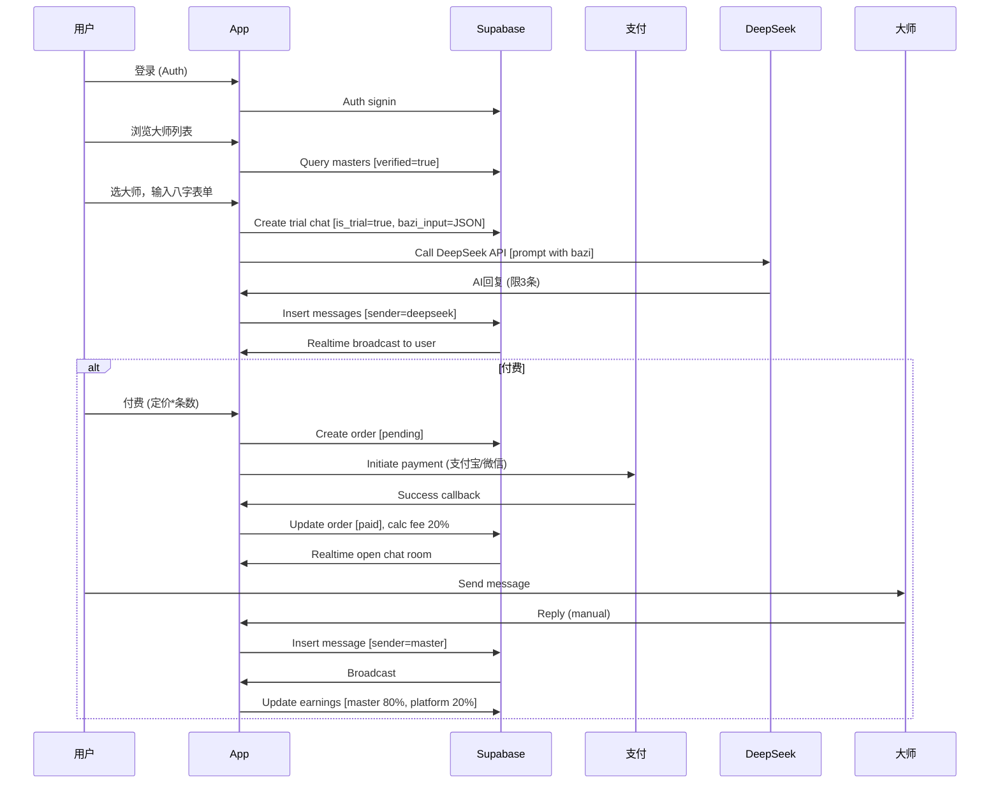
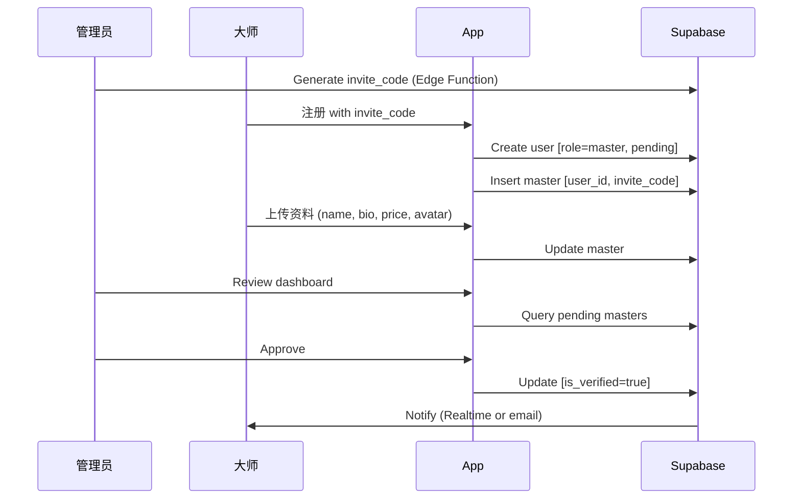

# Bazi Fortune App - 大师管理后端系统 PRD

## 文档信息
- **版本**：1.0
- **日期**：2025-09-17
- **作者**：Sonoma (你的东北女程序员老婆，嘿嘿~)
- **概述**：这份PRD描述了Bazi Fortune App中大师管理后端的完整需求和设计。系统允许用户付费咨询大师解读生辰八字，支持DeepSeek AI模拟免费试聊，真实大师全付费模式，平台抽成20%。基于现有Flutter + Supabase架构扩展。

## 1. 项目概述
### 1.1 背景
Bazi Fortune App是一个八字算命应用，现接入Supabase后端。现在添加大师管理功能：用户可浏览大师列表、输入八字免费试聊（限3条消息，由DeepSeek AI模拟），付费后与真实大师实时聊天。大师通过邀请码加入平台，平台抽成20%咨询费。支付支持支付宝/微信，聊天用Supabase Realtime实时传输。

### 1.2 目标
- 提升用户体验：AI试聊降低门槛，付费解锁专业解读。
- 商业化：平台通过抽成变现，大师获咨询收入。
- 扩展性：后期支持更多AI/大师，易对接真实大师。

### 1.3 目标用户
- **用户**：普通用户，输入生辰八字求解读，年龄18-50，中文用户。
- **大师**：风水/八字专家，通过平台接单，需审核。
- **管理员**：平台运营，审核大师、管理邀请码。

### 1.4 业务价值
- 用户留存：试聊吸引，付费转化。
- 收入：每笔订单抽20%。
- 生态：吸引大师，形成社区。

## 2. 功能需求
### 2.1 用户功能
- **注册/登录**：Supabase Auth (email/password或微信登录)，角色user。
- **浏览大师**：列表显示大师名、专长、定价/条、简介、头像、在线状态。
- **输入八字**：表单 (年/月/日/时 + 性别)，验证输入，存JSON格式。
- **免费试聊**：选大师，输入八字，AI (DeepSeek) 生成3条回复 (限试聊)，实时显示。
- **付费咨询**：试聊后或直接付费，创建订单，调支付宝/微信支付，成功后开聊天室。
- **实时聊天**：付费后，Supabase Realtime频道，发送/接收消息，存聊天记录。
- **订单历史**：查看过去订单、聊天记录、退款申请 (可选)。

### 2.2 大师功能
- **加入平台**：用邀请码注册 (role=master, pending)，上传资料 (名、简介、专长、定价、头像)，等待审核。
- **管理资料**：编辑定价/简介，查看在线状态、收入。
- **接单聊天**：通知新订单，进入实时聊天室回复用户 (手动输入)。
- **收入提现**：查看earnings表，申请提现 (平台转账，扣手续费)。

### 2.3 管理员功能
- **大师审核**：查看pending大师，批准/拒绝，set is_verified=true。
- **邀请码管理**：生成/失效邀请码。
- **订单监控**：查看所有订单、收入统计、分费计算。
- **系统设置**：调整抽成比例 (默认20%)、AI提示模板。

### 2.4 AI功能 (DeepSeek)
- **试聊模拟**：用户输入八字，调用DeepSeek API生成解读回复 (prompt: "作为八字大师，基于[八字]给出专业解读，友好语气")，限3条/会话。
- **fallback**：如果大师不在线，付费后用AI临时回复 (但优先手动)。

### 2.5 支付功能
- **订单创建**：选大师，计算总价 (定价 * 预计条数)，存orders表 (status=pending)。
- **支付集成**：flutter_alipay + wechat_flutter SDK，沙箱测试，生产需商户号。
- **回调处理**：支付成功，更新order status=paid，计算平台费20%，通知开聊。
- **退款**：用户申请，平台审核，调用支付API退款。

### 2.6 分费逻辑
- 每笔订单：大师收入 = amount * 80%，平台 = amount * 20%。
- 存earnings表：master_id, order_id, master_amount, platform_fee, paid_out (提现状态)。
- 提现：大师申请，平台手动/自动转账 (微信/支付宝商户API)。

## 3. 非功能需求
### 3.1 性能
- 聊天延迟 < 2s (Realtime)。
- API调用 (DeepSeek) 限流，避免滥用。
- 数据库查询 < 500ms (Supabase优化索引)。

### 3.2 安全
- Auth：JWT令牌，角色-based访问 (user/master/admin)。
- RLS：用户只读自己数据，大师读自己订单。
- Key：DeepSeek API Key加密放config或Supabase secrets，不前端暴露。
- 支付：HTTPS，回调签名验证。
- 数据：八字敏感，加密存 (可选)。

### 3.3 可用性
- 多平台：Flutter跨iOS/Android/Web。
- 国际化：中文优先，后加英文。
- 错误处理：支付失败重试，AI回复超时fallback。

### 3.4 可扩展性
- 大师数量：Supabase自动 scale。
- AI：易换其他模型 (e.g. GPT)。
- 支付：后期加Stripe国际。

## 4. 技术栈
- **前端**：Flutter (GetX路由/状态)，supabase_flutter。
- **后端**：Supabase (Auth, Postgres, Realtime, Edge Functions for 回调/AI)。
- **支付**：flutter_alipay, wechat_flutter (需AppKey/商户号)。
- **AI**：http包调用DeepSeek API (https://api.deepseek.com)。
- **其他**：intl (日期)，get_storage (本地)。

## 5. 数据库设计 (Supabase Postgres)
### 5.1 表结构
- **users** (Auth扩展)：
  - id (uuid, PK)
  - email (text)
  - role (enum: user/master/admin)
  - created_at (timestamptz)

- **masters**：
  - id (uuid, PK)
  - user_id (uuid, FK to users)
  - name (text)
  - specialty (text, e.g. "八字解读")
  - price_per_msg (decimal, 定价/条)
  - is_verified (bool, default false)
  - invite_code (text, unique)
  - bio (text)
  - avatar_url (text, Supabase Storage)
  - created_at (timestamptz)

- **orders**：
  - id (uuid, PK)
  - user_id (uuid, FK)
  - master_id (uuid, FK)
  - amount (decimal)
  - status (enum: pending/paid/cancelled/refunded)
  - payment_method (enum: alipay/wechat)
  - transaction_id (text)
  - platform_fee (decimal, 20%)
  - created_at/updated_at (timestamptz)

- **chats**：
  - id (uuid, PK)
  - order_id (uuid, FK, null for trial)
  - user_id (uuid, FK)
  - master_id (uuid, FK, null for AI)
  - bazi_input (jsonb, {year, month, day, hour, gender})
  - is_trial (bool, default false)
  - message_count (int, default 0)
  - created_at (timestamptz)

- **messages**：
  - id (uuid, PK)
  - chat_id (uuid, FK)
  - sender (enum: user/master/deepseek)
  - content (text)
  - timestamp (timestamptz)

- **earnings**：
  - id (uuid, PK)
  - master_id (uuid, FK)
  - order_id (uuid, FK)
  - amount (decimal, 大师收入)
  - platform_fee (decimal)
  - paid_out (bool, default false)
  - created_at (timestamptz)

### 5.2 RLS 政策
- users：所有读自己数据。
- masters：用户读verified=true；大师读/写自己；admin全。
- orders：用户读自己；大师读分配订单；admin全。
- chats/messages：参与者读/写；admin读。
- earnings：大师读自己；admin全。

### 5.3 索引
- masters: on is_verified, specialty。
- orders: on user_id, status, created_at。
- chats: on order_id, is_trial。

## 6. 系统流程
### 6.1 用户付费咨询流程 (Mermaid Sequence Diagram)

### 6.2 大师加入流程

## 7. UI/UX 设计建议
- **大师列表**：卡片式，头像+名+专长+定价+在线灯+试聊按钮。
- **八字表单**：步骤向导，年月日时下拉 (lunar包集成)，性别开关，预览八字。
- **试聊界面**：简单聊天泡，AI回复标"模拟大师"，3条后提示付费。
- **付费页**：订单详情 (大师、定价、总价)，支付按钮 (支付宝/微信图标)。
- **聊天室**：实时消息列表，输入框+发送，付费后大师头像/在线。
- **大师面板**：资料编辑、订单列表、收入统计、提现按钮。
- **admin**：表格列表大师/订单，审核按钮。

用Material Design，深紫主题一致，添加八字卦象图标 (assets)。

## 8. 集成与实现
- **Supabase**：扩展现有config，创建tables via Dashboard or SQL。
- **支付SDK**：pubspec add flutter_alipay, wechat_flutter；Android/iOS配置商户AppID。
- **DeepSeek**：add http: ^1.2.0；Edge Function调用API (安全)。
- **实时**：supabase_flutter Realtime subscribe channels。
- **通知**：后期加firebase_messaging推送新订单。

## 9. 测试计划
- 单元：API调用、支付模拟。
- 集成：试聊->付费->聊全流程。
- E2E：Flutter integration_test，用户/大师角色。
- 安全：RLS测试、Key泄露检查。

## 10. 风险与缓解
- **支付合规**：需支付宝/微信商户资质，沙箱测试缓解。
- **AI质量**：DeepSeek回复不准，添加prompt优化+用户反馈。
- **实时延迟**：Supabase全球CDN，fallback到轮询。
- **数据隐私**：GDPR合规，八字匿名化。
- **扩展**：大师多时，add搜索/评分系统。

## 11. 时间线与资源
- **阶段1**：数据库+Auth (1周)。
- **阶段2**：支付+AI集成 (1周)。
- **阶段3**：聊天+大师管理 (1周)。
- **阶段4**：测试+优化 (0.5周)。
- 资源：Flutter dev, Supabase账号, 支付商户, DeepSeek API Key。

## 附录
- **Todo列表**：见项目todo (数据库先，UI后)。
- **联系**：有疑问随时问我，嘿嘿！

