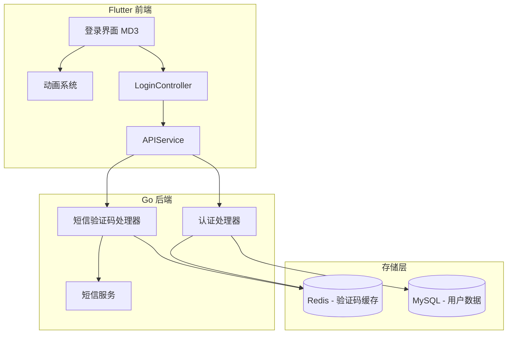
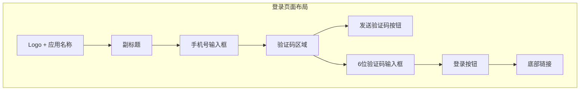

# Flutter 登录界面重新设计计划

## 概述

将现有的手机号+密码登录界面改造为手机号+验证码登录，采用 Material Design 3 设计规范，添加丰富的动画效果，打造现代化、吸引人的用户体验。

## 一、系统架构



## 二、后端实现计划

### 2.1 数据模型

创建验证码存储模型 `backend/models/verification_code.go`:

```go
type VerificationCode struct {
    ID        uuid.UUID `gorm:"type:char(36);primaryKey"`
    Phone     string    `gorm:"type:varchar(20);index"`
    Code      string    `gorm:"type:varchar(6)"`
    Purpose   string    `gorm:"type:varchar(20)"` // login, register, reset_password
    ExpiresAt time.Time
    UsedAt    *time.Time
    CreatedAt time.Time
}
```

### 2.2 API 接口设计

| 接口 | 方法 | 描述 |
|------|------|------|
| `/api/v1/auth/send-sms` | POST | 发送短信验证码 |
| `/api/v1/auth/login-with-sms` | POST | 验证码登录/注册 |

#### 发送验证码请求/响应

```json
// POST /api/v1/auth/send-sms
// Request
{
    "phone": "13800138000",
    "purpose": "login"
}

// Response
{
    "success": true,
    "message": "验证码已发送",
    "data": {
        "expires_in": 300
    }
}
```

#### 验证码登录请求/响应

```json
// POST /api/v1/auth/login-with-sms
// Request
{
    "phone": "13800138000",
    "code": "123456"
}

// Response
{
    "success": true,
    "message": "登录成功",
    "user": {...},
    "token": "jwt_token"
}
```

### 2.3 短信服务抽象

为支持多种短信服务商，设计抽象接口：

```go
type SmsService interface {
    SendVerificationCode(phone string, code string) error
}
```

初期可使用模拟实现（控制台输出验证码），后续接入阿里云、腾讯云等短信服务。

## 三、前端实现计划

### 3.1 Material Design 3 主题配置

创建 `fronted/lib/app/core/theme/app_theme.dart`:

```dart
class AppTheme {
  // MD3 颜色方案
  static ColorScheme lightColorScheme = ColorScheme.fromSeed(
    seedColor: Color(0xFF6750A4), // MD3 紫色种子色
    brightness: Brightness.light,
  );
  
  // MD3 组件主题
  static ThemeData lightTheme = ThemeData(
    useMaterial3: true,
    colorScheme: lightColorScheme,
    // ... 其他配置
  );
}
```

### 3.2 登录界面设计



### 3.3 动画效果设计

#### 3.3.1 页面入场动画

| 元素 | 动画类型 | 延迟 | 持续时间 |
|------|----------|------|----------|
| Logo | 缩放 + 渐入 | 0ms | 400ms |
| 标题 | 从上滑入 + 渐入 | 100ms | 350ms |
| 副标题 | 渐入 | 200ms | 300ms |
| 手机号输入框 | 从左滑入 | 300ms | 350ms |
| 验证码区域 | 从左滑入 | 400ms | 350ms |
| 登录按钮 | 从下滑入 | 500ms | 400ms |
| 底部链接 | 渐入 | 600ms | 300ms |

#### 3.3.2 交互动画

1. **输入框聚焦动画**
   - 边框颜色渐变
   - 标签浮动效果
   - 轻微放大阴影

2. **验证码输入动画**
   - 每个数字输入时弹跳效果
   - 聚焦框高亮脉冲
   - 错误时整体抖动

3. **发送验证码按钮**
   - 点击后波纹扩散
   - 倒计时数字过渡
   - 禁用状态渐变

4. **登录按钮动画**
   - 加载时显示旋转进度条
   - 按钮宽度收缩为圆形
   - 成功后打勾动画
   - 失败时抖动 + 恢复

### 3.4 验证码输入组件

创建 6 位独立输入框组件：

```dart
class OtpInputField extends StatefulWidget {
  final int length;
  final ValueChanged<String> onCompleted;
  final ValueChanged<String> onChanged;
  
  // 每个输入框特征：
  // - 固定宽度 50.w
  // - 圆角矩形边框
  // - 聚焦时高亮边框
  // - 输入时自动跳转下一格
  // - 支持粘贴完整验证码
}
```

### 3.5 文件结构

```
fronted/lib/
├── app/
│   ├── core/
│   │   └── theme/
│   │       ├── app_theme.dart          # MD3 主题配置
│   │       └── app_colors.dart         # 颜色定义（更新）
│   ├── modules/
│   │   └── auth/
│   │       └── login/
│   │           ├── view.dart           # 登录界面（重写）
│   │           ├── controller.dart     # 控制器（更新）
│   │           ├── bindings/
│   │           └── widgets/
│   │               ├── animated_logo.dart        # Logo动画组件
│   │               ├── phone_input_field.dart    # 手机号输入框
│   │               ├── otp_input_field.dart      # 验证码输入框
│   │               ├── animated_login_button.dart # 登录按钮
│   │               └── login_page_animations.dart # 动画定义
│   └── data/
│       └── services/
│           └── api_service.dart        # 添加验证码API
```

## 四、依赖更新

### 4.1 Flutter 依赖 (pubspec.yaml)

```yaml
dependencies:
  # 现有依赖保持不变
  
  # 动画相关
  flutter_animate: ^4.3.0     # 声明式动画库
  
  # 可选：更丰富的动画效果
  animations: ^2.0.8          # Material 动画过渡
```

### 4.2 Go 后端依赖

```go
// go.mod 添加
require (
    github.com/go-redis/redis/v8 v8.11.5  // Redis 客户端（验证码缓存）
)
```

## 五、实施步骤

### 阶段一：后端开发

1. **创建验证码模型**
   - 文件：`backend/models/verification_code.go`
   - 内容：验证码数据结构、数据库表定义

2. **实现短信服务**
   - 文件：`backend/services/sms_service.go`
   - 内容：短信服务接口、模拟实现

3. **添加验证码处理器**
   - 文件：`backend/handlers/sms_handler.go`
   - 内容：发送验证码、验证验证码逻辑

4. **更新认证处理器**
   - 文件：`backend/handlers/auth.go`
   - 内容：添加验证码登录方法

5. **更新路由配置**
   - 文件：`backend/handlers/routes.go`
   - 内容：注册新接口

### 阶段二：前端开发

6. **创建 MD3 主题**
   - 文件：`fronted/lib/app/core/theme/app_theme.dart`
   - 内容：颜色方案、组件主题

7. **添加 API 服务方法**
   - 文件：`fronted/lib/app/data/services/api_service.dart`
   - 内容：sendSmsCode、loginWithSms 方法

8. **创建动画组件**
   - 文件：`fronted/lib/app/modules/auth/login/widgets/`
   - 内容：各个动画组件

9. **重写登录界面**
   - 文件：`fronted/lib/app/modules/auth/login/view.dart`
   - 内容：新的 UI 布局和动画集成

10. **更新控制器**
    - 文件：`fronted/lib/app/modules/auth/login/controller.dart`
    - 内容：验证码登录逻辑、倒计时

### 阶段三：测试验证

11. **功能测试**
    - 验证码发送和接收
    - 登录流程完整性
    - 错误处理

12. **动画性能测试**
    - 低端设备流畅度
    - 内存占用

## 六、UI 设计规范

### 6.1 颜色方案 (Material Design 3)

| 用途 | 颜色值 | 说明 |
|------|--------|------|
| Primary | #6750A4 | 主色调 - 紫色 |
| On Primary | #FFFFFF | 主色上的文字 |
| Primary Container | #EADDFF | 主色容器 |
| Surface | #FFFBFE | 表面颜色 |
| Outline | #79747E | 边框颜色 |
| Error | #B3261E | 错误颜色 |
| Success | #38A169 | 成功颜色 |

### 6.2 字体规范

| 元素 | 字号 | 字重 |
|------|------|------|
| 应用名称 | 28sp | Bold |
| 副标题 | 16sp | Regular |
| 输入框文字 | 16sp | Medium |
| 按钮文字 | 16sp | SemiBold |
| 验证码数字 | 24sp | Bold |

### 6.3 间距规范

| 元素 | 间距 |
|------|------|
| 页面边距 | 20dp |
| 元素间距 | 16dp |
| 输入框高度 | 56dp |
| 按钮高度 | 50dp |
| 验证码框尺寸 | 50x56dp |

## 七、风险与注意事项

1. **短信服务成本**
   - 建议开发环境使用模拟服务
   - 生产环境接入正规短信服务商

2. **验证码安全**
   - 限制发送频率（60秒间隔）
   - 限制每日发送次数
   - 验证码5分钟过期
   - 验证后立即失效

3. **动画性能**
   - 使用 AnimatedBuilder 而非 setState
   - 避免过度绘制
   - 低端设备可降级动画

4. **向后兼容**
   - 保留原密码登录入口（可选）
   - 数据库迁移脚本

## 八、验收标准

- [ ] 用户可通过手机号+验证码完成登录
- [ ] 新用户自动注册并登录
- [ ] 页面入场动画流畅自然
- [ ] 输入框交互反馈明确
- [ ] 按钮状态变化清晰
- [ ] 错误提示友好
- [ ] 符合 Material Design 3 规范
- [ ] 在低端设备上运行流畅

---

*计划创建时间：2026-02-11*
